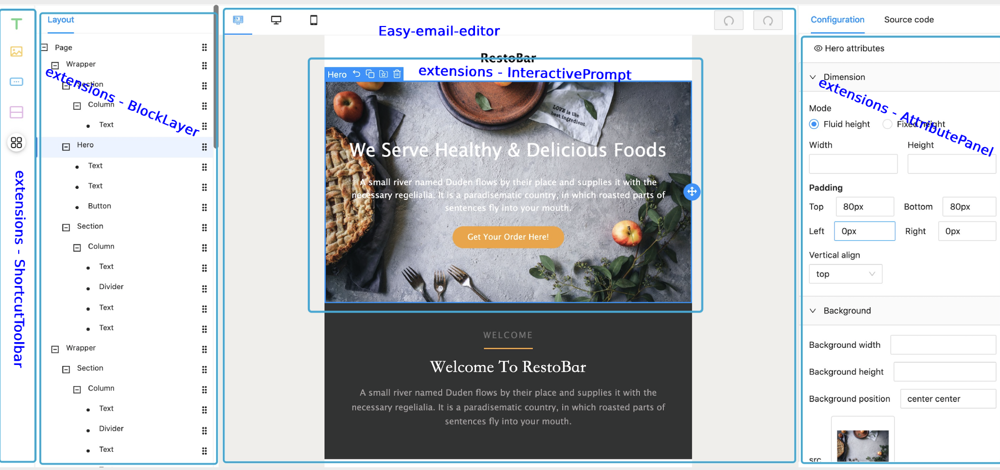

# Anteros Easy Email

<p align="center">

  <br/>
  <a aria-label="Vercel logo" href="https://vercel.com">
    
  </a>
  <br/>

  
  <a aria-label="NPM version" href="https://www.npmjs.com/package/anteros-email-editor">
    
  </a>
  <a aria-label="React version" href="https://react.js">
    
  </a>
  <a aria-label="MJML" href="https://mjml.io/">
    
  </a>
  <a aria-label="Package size" href="https://www.typescriptlang.org/">
    
  </a>
  
</p>

## Introdução

Anteros Easy Email é desenvolvido com base no [MJML](https://mjml.io/) e tem uma compatibilidade muito boa, ao mesmo tempo em que pode gerar código através de edição de arrastar e soltar.

## Recursos:

- Editor de arrastar e soltar
- Pode ser convertido em `MJML`, ou gerado através de `MJML`
- Bloco personalizado definido
-Renderização dinâmica
- Personalize facilmente a interface do usuário quando precisar
- Configuração do tema

## Começando

```sh
$ npm install --save anteros-email-core anteros-email-editor anteros-email-extensions react-final-form
```

or

```sh
$ yarn add anteros-email-core anteros-email-editor anteros-email-extensions react-final-form
```

```js
import React from 'react';
import { BlockManager, BasicType } from '@anterostecnologia/anteros-email-core';
import { EmailEditor, EmailEditorProvider } from '@anterostecnologia/anteros-email-editor';
import { SimpleLayout } from '@anterostecnologia/anteros-email-extensions';

import 'anteros-email-editor/lib/style.css';
import 'anteros-email-extensions/lib/style.css';
import '@arco-themes/react-anteros-email-theme/css/arco.css'; // tema, se você precisar alterar o tema, você pode fazer uma duplicata em https://arco.design/themes/design/1799/setting/base/Color

const initialValues = {
  subject: 'Bem-vindo ao anteros-email',
  subTitle: 'Prazer em conhecê-lo!',
  content: BlockManager.getBlockByType(BasicType.PAGE)!.create({}),
};

function App() {
  return (
    <EmailEditorProvider
      data={initialValues}
      height={'calc(100vh - 72px)'}
      autoComplete
      dashed={false}
    >
      {({ values }) => {
        return (
          <SimpleLayout>
            <EmailEditor />
          </SimpleLayout>
        );
      }}
    </EmailEditorProvider>
  );
}

export default App;


## Configuração

| propriedade           | Tipo                                                                                               | Descrição                                                                                                                          |
| ------------------ | -------------------------------------------------------------------------------------------------- | ------------------------------------------------------------------------------------------------------------------------------------ |
| height             | string / number                                                                                    | Set the height of the container                                                                                                      |
| data               | interface IEmailTemplate { content: IPage; subject: string; subTitle: string; }                    | Source data                                                                                                                          |
| children           | ( props: FormState<T>,helper: FormApi<IEmailTemplate, Partial<IEmailTemplate>>) => React.ReactNode | ReactNode                                                                                                                            |
| onSubmit           | Config<IEmailTemplate, Partial<IEmailTemplate>>['onSubmit'];                                       | Chamado quando o commit é acionado manually                                                                                         |
| fontList           | { value: string; label: string; }[];                                                               | Lista de fontes padrão.                                                                                                                   |
| interactiveStyle   | { hoverColor?: string; selectedColor?: string;}                                                    | Prompt interativo color                                                                                                             |
| onUploadImage      | (data: Blob) => Promise<string>;                                                                   | Acionado quando uma imagem é colada ou carregada                                                                                        |
| onAddCollection    | (payload: CollectedBlock) => void;                                                                 | Adicionar à lista de coleções                                                                                                               |
| onRemoveCollection | (payload: { id: string; }) => void;                                                                | Remover da lista de coleções                                                                                                          |
| dashed             | boolean                                                                                            | Show tracejadas                                                                                                                         |
| autoComplete       | boolean                                                                                            | Completa automaticamente os blocos ausentes. Por exemplo, Text => Section, irá gerar Text=>Column=>Section                             |
| mergeTags          | Object                                                                                             | A merge tag é um código específico que permite inserir dados dinâmicos em e-mails. Como `{{user.name}}`, e usado para visualização |
| previewInjectData  | Object                                                                                             | Dados dinâmicos para visualização, ele substituirá mergeTags.                                                                              |
| onBeforePreview    | (html: string, mergeTags: PropsProviderProps['mergeTags']) => string                               | Promise<string> Você pode substituir mergeTags ao visualizar.                                                                           |

## Teclas de atalho

| tecla de atalho            | Descrição                                                                                       |
| ----------------- | ------------------------------------------------------------------------------------------------- |
| mod+z             | undo                                                                                              |
| mod+y             | redo                                                                                              |
| delete/backspace  | excluir block                                                                                      |
| tab / shift + tab | bloco de seleção rápida, se o bloco estiver focando, `tab` selecione o próximo bloco e `shift + tab` selecione o bloco anterior |

## Packages

- [anteros-email-core](./packages/anteros-email-core/readme.md)
- [anteros-email-editor](./packages/anteros-email-editor/readme.md)
- [anteros-email-extensions](./packages/anteros-email-extensions/readme.md)

   

</br>

## License

The MIT License
